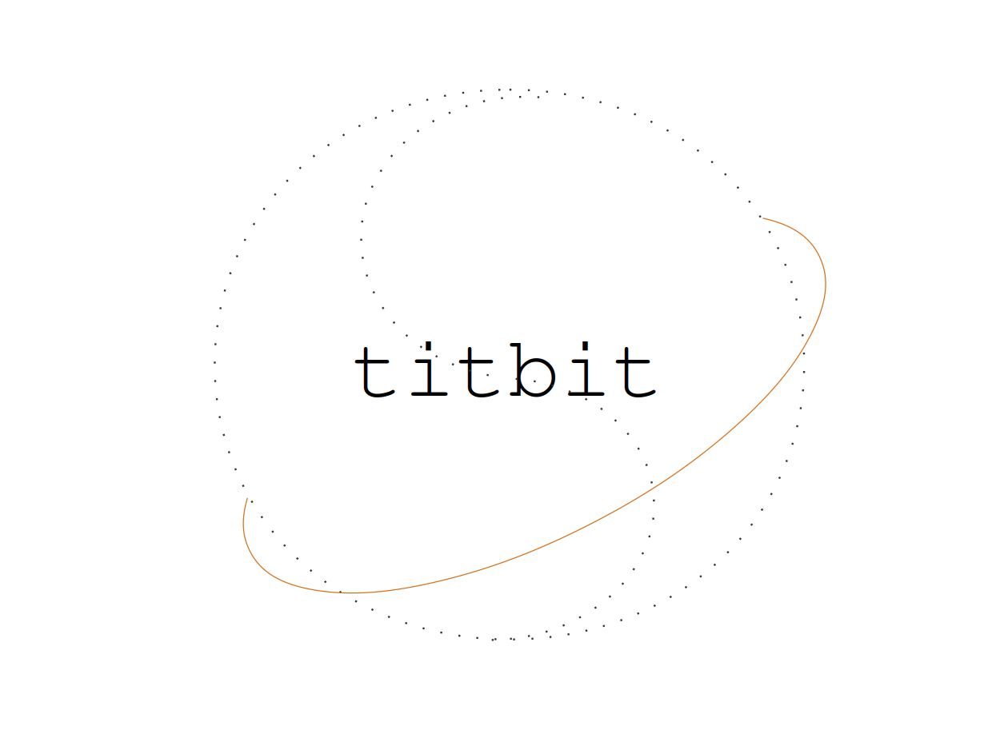
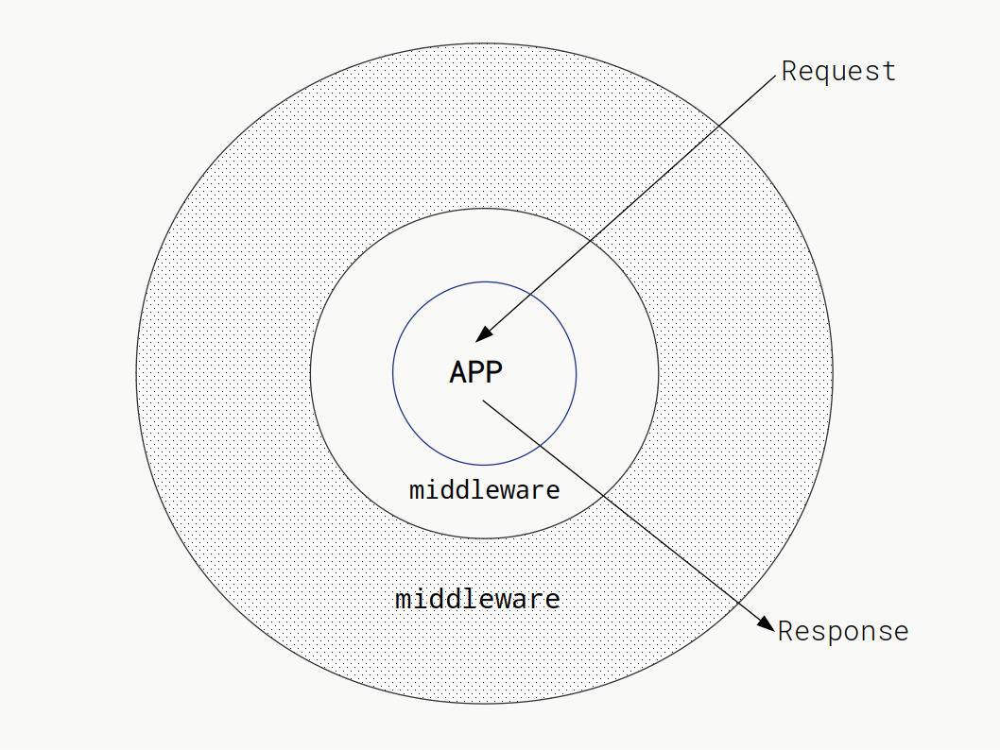
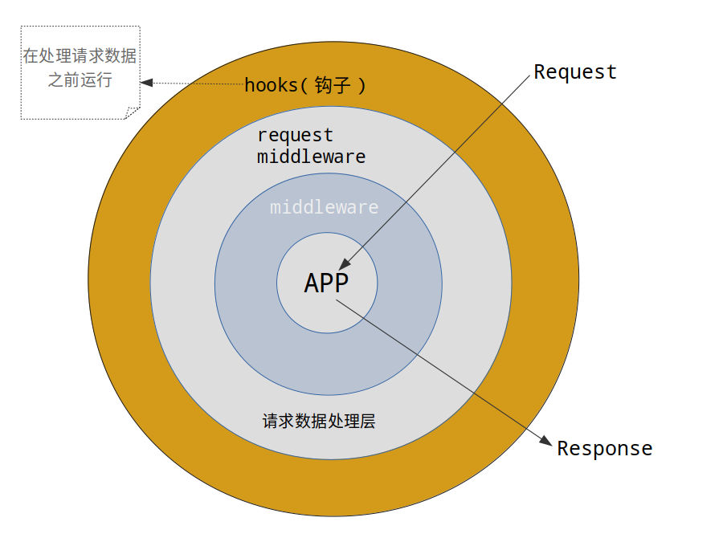

# titbit

Node.js的Web开发框架，同时支持HTTP/1.1和HTTP/2协议， 提供了强大的中间机制。

中间件模式做了扩展支持按照请求类型执行，同时支持根据路由分组执行。抽离出了请求过滤模块，方便维护和替换。解析body数据也改成了独立模块，并提供一个中间件，但是框架会有默认启用并提供了设置项。

大部分核心模块都使用class进行了重写，路由部分进行了大量修改，使用更简单了，并且采用了分离式分组设计。

更多内容，查看[wiki](https://github.com/master-genius/titbit/wiki)

核心功能：

* 中间件模式
* 路由分组/中间件按照路由分组执行
* 中间件匹配请求方法和路由来执行
* 开启守护进程：使用cluster模块
* 显示子进程负载情况
* 提供了解析body数据模块
* 支持通过配置启用HTTP/1.1或是HTTP/2服务
* 支持配置启用HTTPS服务（HTTP/2服务必须要开启HTTPS）
* 限制请求数量
* 限制一段时间内单个IP的最大访问次数
* IP黑名单和IP白名单

## 安装

```
npm i titbit
```

## 最小示例

``` JavaScript
'use strict';

const titbit = require('titibit');

var app = new titbit();

var {router} = app;

router.get('/', async c => {
  c.res.body = 'success';
});

//默认监听0.0.0.0
app.run(2019);

```

## 获取URL参数和表单数据

``` JavaScript
'use strict';

const titbit = require('titibit');

var app = new titbit();

var {router} = app;

router.get('/q', async c => {
  //URL中?后面的查询字符串解析到query中。
  c.res.body = c.query;
});

router.post('/p', async c => {
  //POST、PUT提交的数据保存到body，如果是表单则会自动解析，否则只是保存原始文本值，
  //可以使用中间件处理各种数据。
  c.res.body = c.body;
});

app.run(2019);

```

## 上传文件

默认会解析上传的文件，你可以在初始化服务的时候，传递parseBody选项关闭它，关于选项后面有详细的说明。
解析后的文件数据在c.files中存储，想知道具体结构请往下看。

``` JavaScript
'use strict';

const titbit = require('titibit');

var app = new titbit();

var {router} = app;

//添加中间件过滤上传文件的大小，后面有中间件详细说明。
//第二个参数表示只针对POST请求，并且路由命名为upload-image路由执行。
app.use(async (c, next) => {
  //解析后的文件在c.files中存储，通过getFile可以方便获取文件数据。
  let upf = c.getFile('image');
  if (!upf) {
    c.res.body = 'file not found';
    return ;
  } else if (upf.data.length > 2000000) {
    c.res.body = 'max file size: 2M';
    return ;
  }
  await next(c);

}, {method: 'POST', name: 'upload-image'});

router.post('/upload', async c => {
  let f = c.getFile('image');
  //此函数是助手函数，配合解析后的文件使用。
  //会自动生成文件名。
  try {
    c.res.body = await c.moveFile(f, {
      path: process.env.HOME + '/tmp/image'
    });
  } catch (err) {
    c.res.body = err.message;
  }
}, 'upload-image'); //给路由命名为upload-image，可以在c.name中获取。

app.run(2019);

```

## c.files数据结构

```

{
  "image" : [
    {
      'content-type': CONTENT_TYPE,
      filename: ORIGIN_FILENAME,
      start : START,
      end   : END,
      length: LENGTH
    },
    ...
  ],

  "video" : [
    {
      'content-type': CONTENT_TYPE,  //文件类型
      filename: ORIGIN_FILENAME //原始文件名
      start : START, //ctx.rawBody开始的索引位置
      end   : END,   //ctx.rawBody结束的索引位置
      length: LENGTH,  //文件长度，字节数
    },
    ...
  ]
}
```
c.getFile就是通过名称索引，默认索引值是0，如果是一个小于0的数字，则会获取整个文件数组，没有返回null。

## 中间件

中间件是一个很有用的模式，不同语言实现起来多少还是有些区别的，这个框架采用了一个有些不同的设计，并没有参考其他代码，当初是独自设计出来的，目前来说运行还很好，如果有问题，也请不吝赐教。

中间件图示：



此框架的中间件设计需要next中传递请求上下文参数，除此以外，其他使用都没有任何区别，在设计层面上，并不是根据中间件函数的数组取出来动态封装，递归调用，而是在一开始就已经确定了执行链条，并且按照路由分组区分开来，也可以识别不同请求类型和路由确定是否执行还是跳过到下一层，只要请求过来就马上开始执行，所以速度非常快。参考形式如下：

``` JavaScript

/*
  第二个参数可以不填写，表示全局开启中间件。
  现在第二个参数表示：只对POST请求方法才会执行，并且路由分组必须是/api。
  基于这样的设计，可以保证按需执行，不做太多无意义的操作。
*/
app.add(async (c, next) => {
    console.log('before');
    await next(c);
    console.log('after');
}, {method: 'POST', group: '/api'});

```

为了兼容常见框架，提供use接口添加中间件，使用use添加的中间件按照添加顺序执行，而add接口添加的则是采用标准的洋葱模型，按照添加的顺序逆序执行，这两种方式，包括PHP、Python、Node.js在内，都有使用，开发者根据习惯和需要决定如何使用，不过从设计完成后，发现这两种方式可以综合使用，不过比较复杂，不建议这样做。

## hook

一般称为钩子，在这里钩子其实也是中间件，那么和之前所说的中间件有什么区别呢？

主要区别就是在一个请求流程中，所在的位置不同，hook在处理data事件以前，可用于在接收数据之前的权限过滤操作。
得益于之前的中间件机制，仍然可以使用第二个参数作为筛选条件。使用的接口是addHook，其参数和use相同。

下图较完整的说明了请求处理过程：


